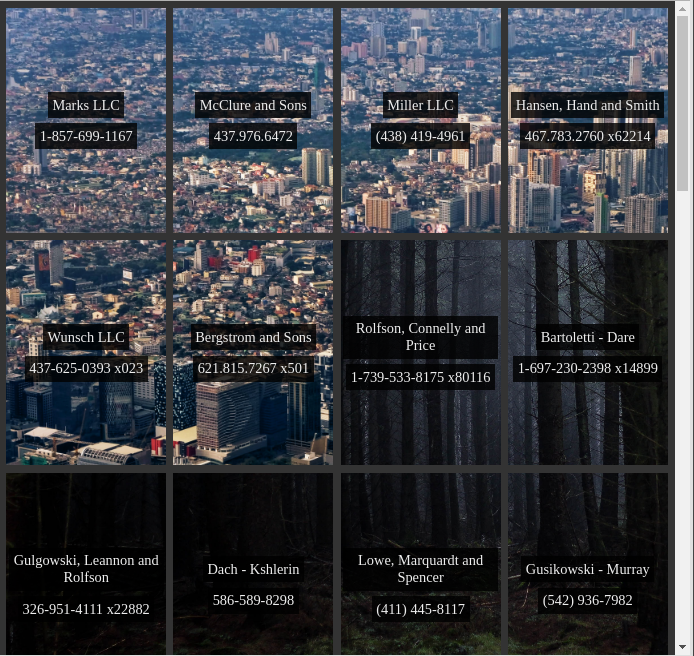

# Berlin - nature and concrete || grid and flexbox styling

## Exercise Course-Module 1 - UserInterfaceBasics (UIB) - HTML/CSS

### Recreated the reference image below, used grid and flex box styling

Created a grid container with four columns, evenly spaced;created a flexbox out of all of the grid items using a vertical layout; Centered all of the flexbox contents vertically and horizontally; Gave the grid items a semi-transparent, fixed background and added other styling until the page matched the example screenshot below

28.09.22

## Notices

- BG1 is by Vitor Fontes from Unsplash: https://unsplash.com/photos/gray-concrete-dinosaur-statue-lying-on-green-grass-near-red-ferris-wheel-w-bvhqRJFe0
- BG2 is by Yeshi Kangrang from Unsplash: https://unsplash.com/photos/person-sitting-on-top-of-the-building-PM_VwL2ypes
